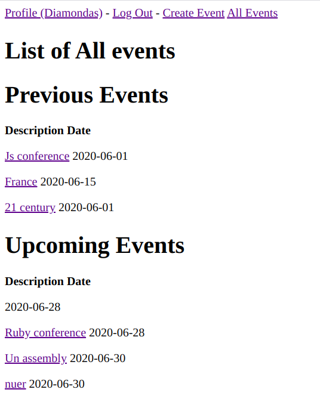

# Private Events - Rails

> Private Events is a project created to practice Rails associations. The app includes user creation and login, event creation, and attending events.

## Models created

- User
- Event
- EventAttending

## Built With

- Ruby 2.7.0
- Rails 6.0.2

## Usage

You can clone or download this repo (you need ruby installed in your computer).

    git clone git@github.com:NiiazalyDzhumaliev/private-events.git

Move to the app directory.

    cd private-events

And finally, run the next instruction to get the gems that are needed for this project.
    
    bundle install

## Screenshot

## How to run test cases

Type next command to run unit tests.

    rspec spec/models

## Author 1

- Github: [@NiiazalyDzhumaliev](https://github.com/NiiazalyDzhumaliev)
- Twitter: [@Niiazaly1](https://twitter.com/Niiazaly1)
- Linkedin: [Niiazaly Dzhumaliev ](https://www.linkedin.com/in/niiazaly-dzhumaliev-117707132/)

## Author 2

- Github: [@hillarioh](https://github.com/hillarioh)
- Twitter: [@hillaokri](https://twitter.com/hillaokri)
- Linkedin: [@HillaryOkerio](https://www.linkedin.com/in/hillaryokerio/)

## 🤝 Contributing

Contributions, issues and feature requests are welcome!

Feel free to check the [issues page](issues/).

## Show your support

Give a ⭐️ if you like this project!
